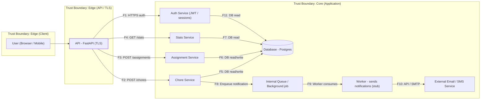

# DFD — Roommate Chores

Проект: Roommate Chores — трекер домашних дел между участниками
Сущности: `User; Chore(title, cadence); Assignment(user_id, due_at, status)`
API: CRUD `/chores`, CRUD `/assignments`, GET `/stats`
Стек: Python / FastAPI + SQLite/Postgres + Pytest

## Диаграмма DFD (Mermaid)

## Пояснения

* **Edge (Client):** браузер/мобильное приложение — недоверенный источник.
* **Edge (API / TLS):** публичный API (FastAPI) — проверяет TLS/аутентификацию.
* **Core (Application):** сервисы, воркеры, внутренняя очередь, БД — зона повышенного доверия.
* **Внешние участники:** Email/SMS провайдер для уведомлений.
* **Хранилища:** БД (Postgres/SQLite), внутренняя очередь (Redis / простая очередь).

## Потоки (идентификаторы)

* **F1** — Аутентификация / передача токена (Browser $\rightarrow$ API)
* **F2** — POST /chores (создание/изменение chore)
* **F3** — POST /assignments (создание/изменение assignment)
* **F4** — GET /stats (агрегаты/статистика)
* **F5** — Chore service $\leftrightarrow$ DB (CRUD)
* **F6** — Assignment service $\leftrightarrow$ DB (CRUD)
* **F7** — Stats service $\leftrightarrow$ DB (read/aggregate)
* **F8** — Chore service $\rightarrow$ Internal Queue (notify event)
* **F9** — Worker $\rightarrow$ Internal Queue (consume job)
* **F10** — Worker $\rightarrow$ External Email/SMS (HTTP/SMTP)
* **F11** — Auth service $\leftrightarrow$ DB (user lookup, password hash)
